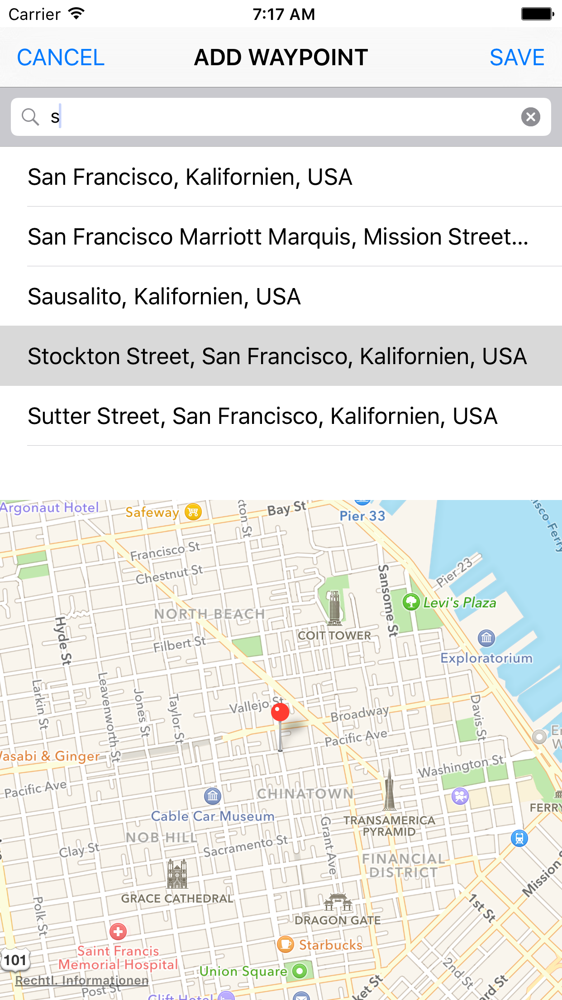
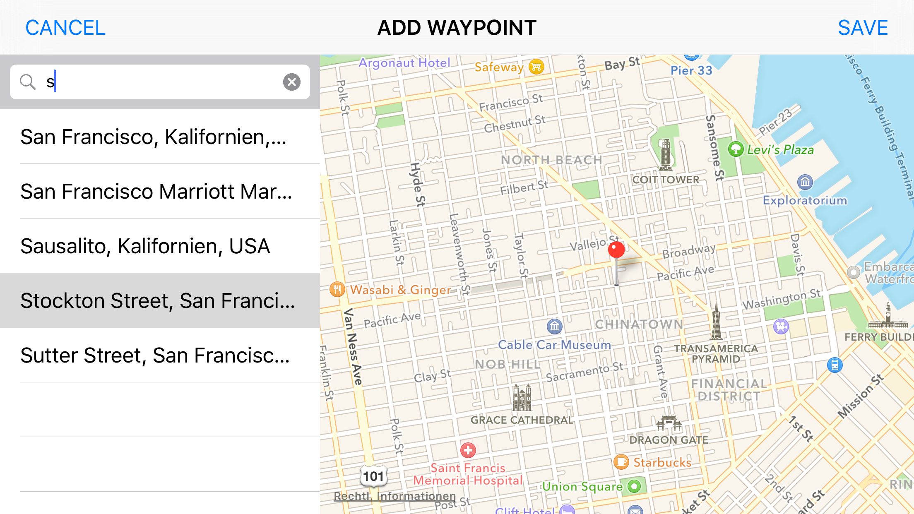

#Lecture

<iframe src="//www.slideshare.net/slideshow/embed_code/key/kNWkYk0rJI1gCA" width="100%" height="400" frameborder="0" marginwidth="0" marginheight="0" scrolling="no" style="border:1px solid #CCC; border-width:1px; margin-bottom:5px; max-width: 100%;" allowfullscreen> </iframe>

[Download the slides here.](https://s3.amazonaws.com/mgwu-misc/MS-17/Slides/Layout.pdf)

#Optional Exercise

Using size classes, can you create an adaptive layout that shows the search bar and search results side by side with the map, for the *Regular x Any* size class?

The result, when running on an iPhone 6 Simulator in portrait and landscape should look as following:

